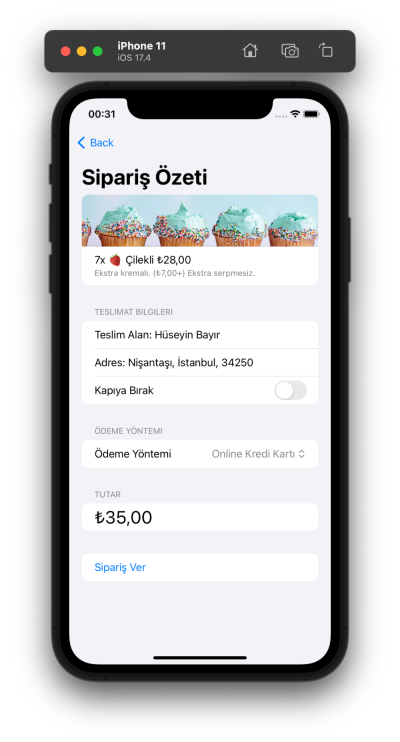

#  KekSepeti

## Giriş

KekSepeti bir iOS uygulamasıdır. Xcode IDE'si üzerinden SwiftUI kullanılarak Swift programlama dili ile oluşturulmuştur. 



---

## İçindekiler
- [Giriş](#giriş)
- [Sistem Gereksinimleri](#sistem-gereksinimleri)
- [Projeyi Klonlamak](#projeyi-klonlamak)
- [Derleme ve Çalıştırma](#derleme-ve-çalıştırma)
- [Nasıl Kullanılır](#nasıl-kullanılır?)
- [Teknik Detaylar](#teknik-detaylar)

---

## Sistem Gereksinimleri
- iOS 17.0+
- Xcode 15.3+
- Swift 5.0+

---

## Projeyi Klonlamak

Proje deposunu klonlamak için bu komutu kullanın:
```bash
git clone https://github.com/hsynbyr2001/KekSepeti.git
```

---

## Derleme Ve Çalıştırma

### `Xcode` ile derleme ve çalıştırma
Projenin lokal ortamda derlenmesi ve çalıştırılması için Xcode kullanabilirsiniz. Xcode ücretsiz bir macOS uygulamasıdır. Apple cihazlarda uygulamalar oluşturmak için sunulmuş bir IDE'dir. Mac App Store'dan indirebilirsiniz.

Projeyi indirdikten sonra Xcode ile açarak ister simulator ile ister fiziksel bir iOS cihaz ile uygulamayı test edebilirsiniz.

---

## Nasıl Kullanılır?

### 1. Kek Mağazası Seç
Farklı türlerde kek satan mağazalardan birini seç. 

### 2. Kek Türünü Seç
Vanilyalı, çilekli, çikolatalı veya gökkuşağı keklerinden birini seç. 

### 3. Kek Adedini Belirle
Seçtiğin kek türünden kaç tane sipariş edeceğini seç.

### 4. Ekstra Malzemeleri Belirle
Ekstra krema veya serpinti ekle.

### 5. Sepeti Gözden Geçit
Ürünleri, tutarı incele ve onayla.

### 6. Sipariş Detaylarını Gir
Adını, sipariş adresini yaz.

### 7. Sipariş Özetini İncele
Sipariş detaylarını gözden geçir ve siparişi tamamla.

### 8. Sipariş Durumunu İncele
Siparişi oluşturduktan sonra durumunu takip et. (Hazırlanıyor, yolda, teslim edildi)

---

## Teknik Detaylar
### App Builder: SwiftUI
Bu uygulama app builder olarak SwiftUI kullanmaktadır.

#### Komponentler
Bu uygulama SwiftUI framework'ünden NavigationStack, Text, Button, Form, ScrollView, HStack, VStack, ForEach, Stepper, Toggle, Task gibi komponentler içermektedir. Adres sayfasında MapKit kullanılmıştır.

#### Kullanıcı Profili
Bu uygulama içerisinde bulunan Profile class'ını JSON encoder, decoder ve UserDefaults aracılığıyla kaydeder ve gerektiğinde veri tabanından kullanır.

#### Dark Mode & Light Mode
Bu uygulama her iki mod için de uyumludur. Telefonun kendi ayarına göre otomatik dark veya light görünüm alır.

---
